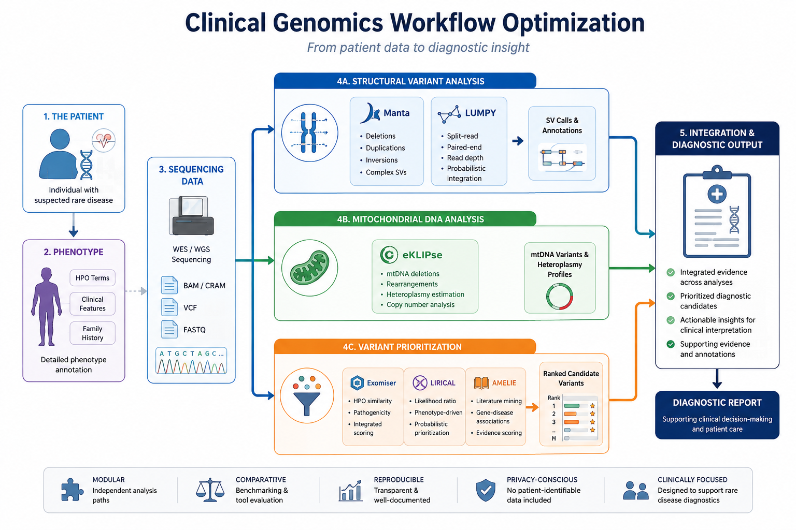
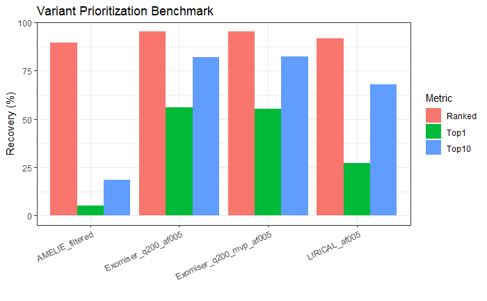
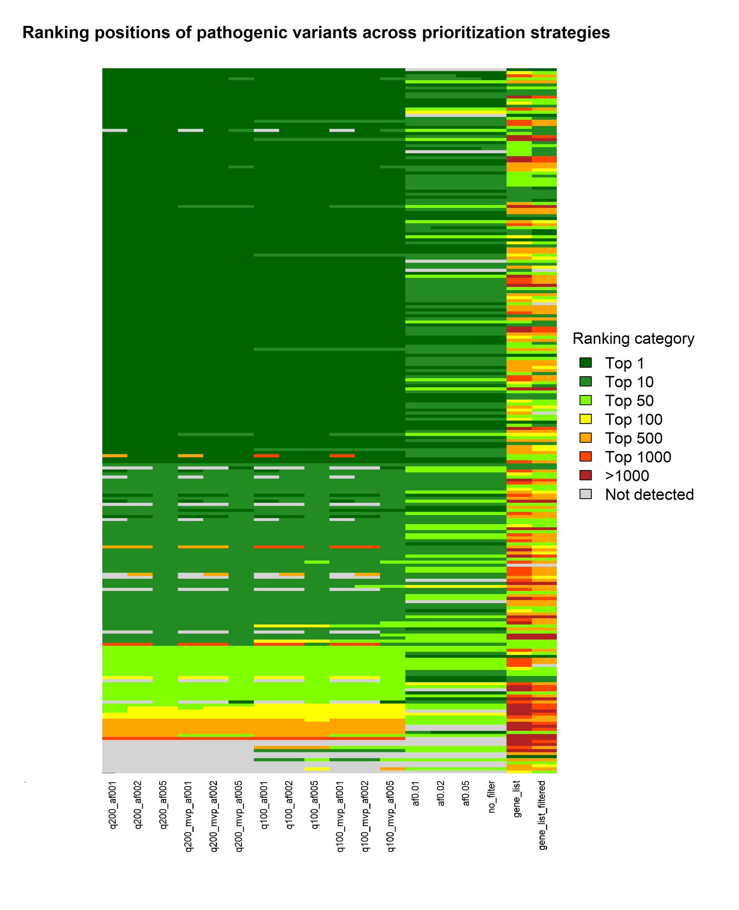

# Clinical Genomics Workflow Optimization


[](#)
[](https://opensource.org/licenses/MIT)

Optimizing analytical strategies for rare disease diagnosis

---

## Project Overview

This repository presents a modular clinical genomics workflow focused on benchmarking and optimization of analytical strategies for rare disease diagnostics.

The project combines:

* Structural variant workflow proposals using Manta and LUMPY
* Mitochondrial DNA analysis integration using eKLIPse
* Real-data benchmarking of phenotype-driven variant prioritization using Exomiser, LIRICAL, and AMELIE



The repository was inspired by workflow optimization proposals developed in a clinical genomics environment to improve reproducibility, interpretability, and diagnostic efficiency.

## Clinical Context and Motivation

Clinical genomics laboratories face increasing pressure to deliver accurate and interpretable results within limited diagnostic timelines.

Rare disease diagnostics remains especially challenging due to genomic heterogeneity, complex structural alterations, mitochondrial variants, and the difficulty of phenotype-driven interpretation.

This repository reflects workflow optimization strategies proposed in a hospital genomics environment to improve:

* Structural variant analysis
* mtDNA interpretation
* Variant prioritization
* Workflow reproducibility and scalability

📄 Full documentation: [Clinical Context and Motivation](docs/clinical_motivation.md)

## Workflow Design and Components

The workflow is organized into three analytical modules:

- **Structural Variant Analysis**: evaluation of complementary SV callers (Manta and LUMPY).
- **Mitochondrial DNA Analysis**: proposed integration of eKLIPse for mtDNA rearrangement detection.
- **Variant Prioritization**: benchmarking of Exomiser, LIRICAL, and AMELIE under multiple configurations.

Only the variant prioritization module was evaluated using real clinical cases.

📄 Full documentation: [Workflow Design And Components](docs/workflow_design.md)

## Analytical Tools and Methods

This workflow integrates several widely used bioinformatics tools that address complementary aspects of clinical genomics analysis. Each tool was selected based on its relevance to rare disease diagnostics, its methodological strengths, and its ability to contribute meaningful evidence for variant interpretation.

| Module | Tools | Purpose |
|----------|----------|----------|
| Structural Variant Analysis | Manta, LUMPY | Detection of large genomic rearrangements |
| mtDNA Analysis | eKLIPse | Detection of mtDNA deletions and heteroplasmy |
| Variant Prioritization | Exomiser, LIRICAL, AMELIE | Phenotype-driven ranking of candidate variants |
| Integration & Filtering | Custom Bash scripts | Specific configuration of the variant prioritization strategy |

The results obtained through variant prioritization were evaluated using real clinical cases during my work in a hospital genomics service. Only results comparing different filtering strategies and prioritization settings are included here, without specific patient information.

📄 Full documentation: [Tools and Methods](docs/tools_and_methods.md)

## Repository Structure

The repository is organized to maintain modularity, reproducibility, and clear separation between workflow components, documentation, and benchmarking results.

```text
clinical-genomics-workflow-optimization/
│
├── .gitignore
├── LICENSE
├── README.md
│
├── config/
│   ├── config.sh
│   └── paths.example.conf
│
├── scripts/
│   ├── manta.sh
│   ├── lumpy.sh
│   ├── exomiser.sh
│   ├── lirical.sh
│   ├── amelie.sh
│   ├── filtering.sh
│   └── integration.sh
│
├── docs/
│   ├── clinical_context.md
│   ├── workflow_design.md
│   ├── tools_and_methods.md
│   ├── variant_prioritization_study.md
│   ├── benchmarking_strategy.md
│   ├── example_outputs.md
│   ├── proposed_improvements.md
│   ├── limitations.md
│   ├── future_work.md
│   └── author.md
│
├── results/
│   ├── comparative_tables/
│   └── prioritization_results/
│
├── examples/
│   ├── exomiser_output_example.tsv
│   ├── lirical_output_example.tsv
│   └── amelie_output_example.tsv
│
└── figures/
    ├── workflow_overview.png
    ├── prioritization_comparison.png
    └── ranking_heatmap.png
```
### Directory Description

| Directory | Description |
|----------|-------------|
| `config/` | Configuration files and example paths required to run the workflow. |
| `scripts/` | Modular scripts implementing SV detection, mtDNA analysis, variant prioritization, and custom integration/filtering logic. |
| `docs/` | Technical documentation describing workflow design, clinical context, benchmarking methodology, and analytical modules. |
| `results/` | Output directories containing benchmarking results and comparative analyses (no real patient data). |
| `examples/` | Example anonymized outputs illustrating expected tool formats. |
| `figures/` | Workflow diagrams and visual summaries of analytical strategies. |

The repository structure was designed to facilitate workflow readability, modular benchmarking, and future extensibility of the analytical framework.

## Setup & Requirements

This repository was designed as a modular benchmarking and workflow evaluation framework.

Main requirements:

* Bash
* Java (Exomiser, LIRICAL)
* Python 3
* Linux environment recommended

Clone the repository:

```bash
git clone https://github.com/davidcivitdecabo/clinical-genomics-workflow-optimization.git
cd clinical-genomics-workflow-optimization
```

Configuration examples are available in:
`config/paths.example.conf`

## Example Outputs

The `examples/` directory contains fully synthetic outputs illustrating the expected structure of Exomiser, LIRICAL, and AMELIE results. These files allow users to test the workflow without requiring clinical datasets.

All example files contain synthetic data only.

📄 Full documentation: [Example Outputs](docs/example_outputs.md)

## Benchmarking Results

The benchmarking study evaluated how different prioritization configurations and filtering strategies affected the ranking of previously validated pathogenic variants in rare disease cases.

Key evaluation aspects:

- Ranking position of known causal variants
- Impact of filtering strategies on prioritization performance
- Comparison of Exomiser and LIRICAL ranking behavior
- Exploratory evaluation of AMELIE-based gene prioritization
- Reproducibility of prioritization results across configurations

**Figure 1.**
Comparison of prioritization performance across filtering configurations.



**Figure 2.**
Heatmap showing ranking positions of known causal variants across patients and prioritization strategies.



## Proposed Improvements

A detailed description of proposed workflow optimizations for SV analysis, mtDNA analysis, and variant prioritization is available in [Proposed_Improvements](docs/proposed_improvements.md).

## Methodological Limitations

Main limitations should be considered when interpreting this repository:


* Structural variant and mtDNA modules are included as workflow design proposals and were not benchmarked using clinical datasets.
* Real clinical benchmarking was limited to variant prioritization analyses using previously diagnosed cases.
* Benchmarking results reflect tool versions and annotation databases available at the time of analysis.
* AMELIE integration was limited by privacy constraints.

Additional methodological details are available in: [Limitations](docs/limitations.md)

## Future Work

Potential future developments include:

* Benchmarking of structural variant and mtDNA workflows
* Expansion of prioritization benchmarking cohorts
* Workflow automation and containerization
* Integration of additional interpretation and annotation layers

Planned extensions and workflow improvements are described in [Future Work](docs/future_work.md).

## Author

Developed by David Civit Decabo, a bioinformatician with experience in clinical genomics, rare disease diagnostics, and molecular laboratory environments.

Background:

* BSc in Biology
* MSc in Bioinformatics and Biostatistics
* Experience in clinical genomics, rare disease analysis, and molecular laboratory environments

Key Skills Demonstrated:

* Clinical genomics workflow evaluation
* Rare disease variant prioritization
* Benchmarking and comparative tool assessment
* Structural variant analysis strategies
* Phenotype-driven genomic interpretation
* Reproducible bioinformatics workflow design
* Bash scripting and workflow modularization

📄 More information about the author in: [Author](docs/author.md)
